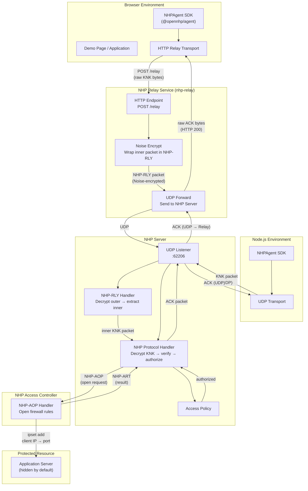

# OpenNHP JavaScript Agent

The JavaScript/TypeScript implementation of the NHP (Network-infrastructure Hiding Protocol) agent and its usage demonstration.

[](https://github.com/OpenNHP/js-agent/actions/workflows/ci.yml)
[](LICENSE)

**Live Demo:** [https://js-agent.opennhp.org](https://js-agent.opennhp.org)

## Overview

OpenNHP is a zero-trust network security protocol that hides protected servers from unauthorized access. This repository contains:

1. **`/nhp-js/`** — Core SDK library (`@opennhp/agent`) implementing the NHP protocol in TypeScript, supporting both browser and Node.js environments.
2. **`/index.html`** — Static demo page showcasing the NHP authentication flow via Okta integration, deployed to GitHub Pages.

## Repository Structure

```text
js-agent/
├── index.html              # Demo page (deployed to js-agent.opennhp.org)
├── CNAME                   # Custom domain for GitHub Pages
├── nhp-js/                 # Core SDK library
│   ├── src/
│   │   ├── NHPAgent.ts     # Main agent class
│   │   ├── types.ts        # TypeScript interfaces and types
│   │   ├── index.ts        # Public API exports
│   │   ├── crypto/         # Cryptographic primitives
│   │   │   ├── ecdh.ts     # X25519 key exchange
│   │   │   ├── aead.ts     # AES-256-GCM encryption
│   │   │   ├── noise.ts    # Noise protocol (Blake2s)
│   │   │   ├── sm2.ts      # SM2 elliptic curve (GMSM)
│   │   │   ├── sm3.ts      # SM3 hash (GMSM)
│   │   │   ├── sm4.ts      # SM4-GCM encryption (GMSM)
│   │   │   └── utils.ts    # Utility functions (base64, zlib, etc.)
│   │   ├── protocol/       # NHP packet format
│   │   │   ├── constants.ts  # Protocol constants and packet types
│   │   │   ├── header.ts     # Packet header structures (240/304 bytes)
│   │   │   └── packet.ts     # Packet build/parse logic
│   │   └── transport/      # Network transports
│   │       ├── udp.ts      # UDP (Node.js default)
│   │       ├── relay.ts    # HTTP Relay (browser default)
│   │       ├── websocket.ts # WebSocket (alternative)
│   │       └── webrtc.ts   # WebRTC DataChannel (experimental)
│   ├── test/               # Unit tests (Vitest)
│   ├── examples/           # Usage examples
│   │   └── relay-test.html     # HTTP Relay transport test page
│   ├── main.js             # Manual test entry point
│   ├── vite.config.ts      # Build configuration
│   ├── tsconfig.json       # TypeScript configuration
│   └── package.json
└── .github/workflows/
    └── ci.yml              # GitHub Actions: build + test on Node 18/20/22
```

## SDK Quick Start

### Installation

```bash
npm install @opennhp/agent
```

### Basic Usage (HTTP Relay — Browser)

The SDK uses an HTTP relay transport for browser environments. The relay is a stateless HTTPS→UDP bridge — the browser POSTs the encrypted NHP packet to the relay, which wraps it in a Noise-encrypted NHP-RLY outer packet and forwards it to the NHP Server over UDP.

```typescript
import { NHPAgent } from '@opennhp/agent';

const agent = new NHPAgent({
  cipherScheme: 'gmsm',       // or 'curve25519'
  transport: 'relay',
  relayUrl: 'https://relay.example.com/relay',
  logLevel: 'info',
});

await agent.init();

agent.setIdentity({
  userId: 'user@example.com',
  deviceId: 'my-device-id',
  organizationId: 'example.org',
});

agent.addServer({
  publicKey: 'BASE64_SERVER_PUBLIC_KEY',
});

const result = await agent.knockResource({
  resourceId: 'protected-resource',
  serviceId: 'my-service',
});

if (result.success) {
  console.log('Access granted until:', new Date(result.expiresAt!));
  console.log('Resource hosts:', result.resourceHosts);
}

await agent.close();
```

**Prerequisites:**

- The agent's public key must be registered in the NHP Server's `etc/agent.toml`
- The relay's public key must be registered in the NHP Server's `etc/relay.toml`

### Basic Usage (UDP — Node.js)

```typescript
import { NHPAgent } from '@opennhp/agent';

const agent = new NHPAgent({
  cipherScheme: 'gmsm',
  logLevel: 'info',
});

await agent.init();

agent.setIdentity({
  userId: 'user@example.com',
  deviceId: 'my-device-id',
  organizationId: 'example.org',
});

agent.addServer({
  publicKey: 'BASE64_SERVER_PUBLIC_KEY',
  host: 'nhp.example.com',
  port: 62206,
});

const result = await agent.knockResource({
  resourceId: 'protected-resource',
  serviceId: 'my-service',
  serverHost: 'nhp.example.com',
  serverPort: 62206,
});

if (result.success) {
  console.log('Access granted until:', new Date(result.expiresAt!));
  console.log('Resource hosts:', result.resourceHosts);
}

await agent.close();
```

## Transport Selection

| Environment | Default | Also Available |
| ----------- | ------- | -------------- |
| Browser | HTTP Relay | WebSocket |
| Node.js | UDP | WebSocket |

Override with `new NHPAgent({ transport: 'relay', relayUrl: '...' })`.

## Protocol Overview

### Cipher Schemes

Two cipher schemes are supported:

| Scheme | Key Exchange | Hash | AEAD | Header Size |
| ------ | ------------ | ---- | ---- | ----------- |
| `curve25519` (default) | X25519 ECDH | Blake2s-256 | AES-256-GCM | 240 bytes |
| `gmsm` | SM2 ECDH | SM3 | SM4-GCM | 304 bytes |

### Noise-Protocol-Inspired Handshake

NHP uses a 4-step handshake:

1. **Agent → Server (KNK)**: Agent sends encrypted knock with identity and resource request, using ephemeral ECDH + server's long-term public key.
2. **Server → Agent (COK)**: If overloaded, server replies with a cookie.
3. **Agent → Server (RNK)**: Agent re-knocks with the cookie included in HMAC.
4. **Server → Agent (ACK)**: Server grants access with resource host mapping and expiry time.

### System Architecture



### HTTP Relay Transport Sequence (Browser)

The relay transport is the primary browser transport. The relay is a Go service that bridges HTTPS to UDP.

```mermaid
sequenceDiagram
    participant User as User
    participant Page as Test Page
    participant Agent as NHPAgent SDK<br/>(Browser)
    participant Relay as NHP Relay<br/>(nhp-relay)
    participant Server as NHP Server
    participant AC as NHP AC<br/>(Access Controller)
    participant Res as Protected Resource

    Note over Res: All ports hidden by default
    Note over Relay: Stateless HTTPS→UDP bridge<br/>Has its own SM2 key pair<br/>Registered as NHP_RELAY peer on Server

    User->>Page: Fill config & click Knock
    Page->>Agent: new NHPAgent({ transport:'relay', relayUrl })
    Agent->>Agent: init() — generate/load SM2 key pair

    Page->>Agent: setIdentity, addServer, knockResource

    rect rgb(40, 60, 90)
        Note over Agent: Step 1: Agent builds KNK packet (413B)<br/>(encrypted to NHP Server's public key)
        Agent->>Agent: buildNHPPacket(KNK, agentPrivKey, agentPubKey,<br/>serverPubKey, knockMsg, compress=true, cipher='gmsm')
        Note over Agent: 304B GMSM header + zlib-compressed<br/>SM4-GCM encrypted payload
    end

    rect rgb(60, 40, 90)
        Note over Agent,Relay: Step 2: Browser POSTs raw KNK bytes to Relay
        Agent->>Relay: POST /relay<br/>Content-Type: application/octet-stream<br/>Body: raw KNK packet (413 bytes)
        Note over Relay: Relay extracts inner counter from<br/>header bytes [16:24] for response matching
    end

    rect rgb(90, 60, 40)
        Note over Relay: Step 3: Relay wraps KNK in NHP-RLY packet
        Relay->>Relay: Build RelayForwardMsg JSON:<br/>{ srcAddr: {ip, port}, innerPkt: base64(KNK) }
        Relay->>Relay: Noise-encrypt with Relay ↔ Server keys
        Note over Relay: NHP-RLY outer packet (932B)<br/>Relay authenticates itself to Server
    end

    rect rgb(40, 90, 60)
        Note over Relay,Server: Step 4: Relay sends NHP-RLY over UDP
        Relay->>Server: UDP NHP-RLY packet (932 bytes)
    end

    rect rgb(60, 90, 40)
        Note over Server: Step 5: Server decrypts NHP-RLY outer packet
        Server->>Server: Verify Relay HMAC (SM3)
        Server->>Server: SM2_ECDH → decrypt RelayForwardMsg
        Server->>Server: Lookup Relay pubkey in relay peer pool
        Server->>Server: Extract real client IP + inner KNK bytes
    end

    rect rgb(90, 40, 60)
        Note over Server: Step 6: Server decrypts inner KNK packet
        Server->>Server: Verify Agent HMAC (SM3)
        Server->>Server: SM2_ECDH(serverPriv, agentEphPub)
        Server->>Server: SM4-GCM decrypt Agent pubkey
        Server->>Server: Lookup Agent pubkey in agent peer pool
        Server->>Server: SM4-GCM decrypt timestamp → anti-replay
        Server->>Server: SM4-GCM decrypt body → decompress<br/>→ {usrId, devId, orgId, aspId, resId}
        Server->>Server: Auth plugin verifies identity
    end

    rect rgb(40, 90, 90)
        Note over Server,AC: Step 7: Server requests AC to open firewall
        Server->>AC: NHP-AOP (490B, UDP)<br/>srcAddrs: [browser IP, gateway IP]<br/>dstAddrs: [resource IP:port]<br/>opnTime: 20s
        AC->>AC: ipset add browser_IP,80,resource_IP timeout 20
        AC-->>Server: NHP-ART (429B)<br/>{ errCode: "0", opnTime: 20, token: "..." }
    end

    alt Server overloaded
        Server-->>Relay: COK packet (UDP, encrypted to Agent)
        Relay-->>Agent: HTTP 200 (raw COK bytes)
        Agent->>Agent: Store cookie
        Agent->>Relay: POST /relay (RNK packet with cookie)
        Relay->>Server: UDP NHP-RLY (wrapping RNK)
    end

    rect rgb(40, 60, 90)
        Note over Server: Step 8: Server builds ACK response (493B)
        Server->>Server: Noise-encrypt ACK to Agent's pubkey<br/>{ errCode:"0", resHost, opnTime, acTokens }
        Note over Server: ACK encrypted to Agent — opaque to Relay<br/>Sent via relay conn (RemoteAddr = relay UDP addr)
    end

    Server-->>Relay: UDP ACK packet (493 bytes)
    Note over Relay: Match by inner counter → forward raw bytes
    Relay-->>Agent: HTTP 200 (raw ACK bytes, 493B)

    Agent->>Agent: parseNHPPacket(ACK, prevChainKey=zeros)<br/>SM3 HMAC verify → SM2 ECDH →<br/>SM4-GCM decrypt → zlib decompress
    Agent-->>Page: KnockResult { success, resourceHosts, expiresAt }
    Page-->>User: Access Granted

    Note over Res: AC opened firewall for browser IP<br/>(timeout 20s, renewable)
    User->>Res: Access resource directly
```



### Encryption Layer Details — Relay Mode

The relay transport involves **two independent encryption layers**:

```text
┌─────────────────────────────────────────────────────────────────┐
│                    NHP-RLY Outer Packet (932B)                  │
│  ┌───────────────────────────────────────────────────────────┐  │
│  │  NHP Header (304B, GMSM)                                 │  │
│  │  • Type: NHP_RLY (9)                                     │  │
│  │  • Ephemeral: Relay's ephemeral SM2 public key           │  │
│  │  • Static: Relay's device public key (SM4-GCM encrypted) │  │
│  │  • HMAC: SM3 hash                                        │  │
│  │  • Encrypted with: Relay ↔ Server shared secret          │  │
│  └───────────────────────────────────────────────────────────┘  │
│  ┌───────────────────────────────────────────────────────────┐  │
│  │  Encrypted Payload (RelayForwardMsg JSON, zlib+SM4-GCM)  │  │
│  │  {                                                        │  │
│  │    "srcAddr": { "ip": "192.168.1.100", "port": 54321 },  │  │
│  │    "innerPkt": "base64(raw KNK packet bytes)"             │  │
│  │  }                                                        │  │
│  └───────────────────────────────────────────────────────────┘  │
│                                                                 │
│  ┌ ─ ─ ─ ─ ─ ─ ─ ─ ─ ─ ─ ─ ─ ─ ─ ─ ─ ─ ─ ─ ─ ─ ─ ─ ─ ─ ┐  │
│    Inner KNK Packet (413B) — OPAQUE to Relay                   │
│  │ ┌─────────────────────────────────────────────────────┐ │  │
│    │  NHP Header (304B, GMSM)                            │     │
│  │ │  • Type: NHP_KNK (1)                                │ │  │
│    │  • Ephemeral: Agent's ephemeral SM2 public key       │     │
│  │ │  • Static: Agent's device public key (encrypted)    │ │  │
│    │  • HMAC: SM3 hash                                    │     │
│  │ │  • Encrypted with: Agent ↔ Server shared secret     │ │  │
│    └─────────────────────────────────────────────────────┘     │
│  │ ┌─────────────────────────────────────────────────────┐ │  │
│    │  Encrypted Payload (AgentKnockMsg JSON, zlib+SM4-GCM)│     │
│  │ │  { usrId, devId, orgId, aspId, resId }              │ │  │
│    └─────────────────────────────────────────────────────┘     │
│  └ ─ ─ ─ ─ ─ ─ ─ ─ ─ ─ ─ ─ ─ ─ ─ ─ ─ ─ ─ ─ ─ ─ ─ ─ ─ ─ ┘  │
└─────────────────────────────────────────────────────────────────┘
```

**Key principle: the Relay never sees the plaintext KNK payload.** The inner KNK packet is encrypted end-to-end between the Agent and the NHP Server. The Relay only sees it as opaque bytes embedded in the `innerPkt` field.

### Verified End-to-End Relay Flow (GMSM cipher scheme)

The following is the complete verified data flow for Browser -> Relay -> NHP Server -> AC, with actual packet sizes observed during testing:

```text
Browser (JS Agent)                    NHP Relay                     NHP Server                      NHP AC
──────────────────                    ─────────                     ──────────                      ──────

1. Agent.init()
   Generate SM2 key pair
   (privKey: 32B, pubKey: 64B)

2. buildNHPPacket(KNK)
   ┌──────────────────────────┐
   │ Noise-IK handshake:      │
   │ • ChainHash = SM3(init)  │
   │ • Generate ephemeral SM2 │
   │ • ESS = SM2_ECDH(        │
   │     ephPriv, serverPub)  │
   │ • Encrypt agentPub       │
   │     via SM4-GCM          │
   │ • SS = SM2_ECDH(         │
   │     agentPriv, serverPub)│
   │ • Encrypt timestamp      │
   │ • Encrypt body (zlib     │
   │     compressed JSON)     │
   │ • HMAC = SM3(header)     │
   │ Output: 413 bytes        │
   └──────────────────────────┘
                │
3. POST /relay  │ 413 bytes
   (raw binary) │
                ▼
              Relay receives HTTP POST
              ┌──────────────────────────┐
              │ Extract inner counter    │
              │   from bytes [16:24]     │
              │ Register pending request │
              │   pendingRequests[ctr]   │
              │                          │
              │ Build RelayForwardMsg:   │
              │ { srcAddr: {ip, port},   │
              │   innerPkt: base64(KNK) }│
              │                          │
              │ buildNHPPacket(NHP_RLY)  │
              │ Noise encrypt with       │
              │   Relay ↔ Server keys    │
              │ Output: 932 bytes        │
              └──────────────────────────┘
                          │
              UDP send    │ 932 bytes
                          ▼
                        Server receives NHP-RLY
                        ┌──────────────────────────┐
                        │ Decrypt outer NHP-RLY:   │
                        │ • Verify Relay HMAC      │
                        │ • SM2_ECDH(serverPriv,   │
                        │     relayEphPub)         │
                        │ • Decrypt Relay pubkey   │
                        │ • Lookup Relay in        │
                        │     relay peer pool      │
                        │ • Decrypt body →         │
                        │     RelayForwardMsg      │
                        │                          │
                        │ HandleRelayForward:      │
                        │ • Extract realClientAddr │
                        │ • Decode inner KNK       │
                        │ • Create relay conn      │
                        │   (key: relay:addr:cli)  │
                        │   RemoteAddr = relayAddr │
                        │   RealRemoteAddr = cli   │
                        │ • Inject KNK into conn   │
                        └──────────────────────────┘
                        ┌──────────────────────────┐
                        │ Decrypt inner NHP-KNK:   │
                        │ • Verify Agent HMAC      │
                        │ • SM2_ECDH(serverPriv,   │
                        │     agentEphPub)         │
                        │ • Decrypt Agent pubkey   │
                        │ • Lookup Agent in        │
                        │     agent peer pool      │
                        │ • Decrypt timestamp      │
                        │ • Anti-replay check      │
                        │ • Decrypt body →         │
                        │   { usrId, devId, orgId, │
                        │     aspId, resId }       │
                        │                          │
                        │ Auth plugin (example):   │
                        │ • "skip auth" for test   │
                        └──────────────────────────┘
                                    │
                        NHP-AOP     │ 490 bytes (UDP)
                        (to AC)     │ Uses RealRemoteAddr
                                    │   for srcAddrs
                                    ▼
                                  AC receives NHP-AOP
                                  ┌──────────────────────────┐
                                  │ Decrypt AOP:             │
                                  │ • Verify Server identity │
                                  │ • Extract srcAddrs:      │
                                  │   192.168.65.1 (browser) │
                                  │   177.7.0.8 (gateway)    │
                                  │ • Execute ipset rules:   │
                                  │   add 192.168.65.1,80,   │
                                  │     177.7.0.10 timeout 20│
                                  │   add 177.7.0.8,80,      │
                                  │     177.7.0.10 timeout 20│
                                  │                          │
                                  │ Build NHP-ART response   │
                                  │   { errCode: "0",        │
                                  │     opnTime: 20,         │
                                  │     token: "..." }       │
                                  └──────────────────────────┘
                                    │
                        NHP-ART     │ 429 bytes (UDP)
                                    │
                                    ▼
                        Server receives NHP-ART
                        ┌──────────────────────────┐
                        │ Build NHP-ACK:           │
                        │ { errCode: "0",          │
                        │   resHost: { demoServer: │
                        │     "localhost" },        │
                        │   opnTime: 15,           │
                        │   agentAddr: "...",       │
                        │   acTokens: { ... } }    │
                        │                          │
                        │ Noise encrypt ACK        │
                        │   to Agent's pubkey      │
                        │ Output: 493 bytes        │
                        │                          │
                        │ Send via relay conn      │
                        │   (RemoteAddr = relay)   │
                        └──────────────────────────┘
                          │
              UDP send    │ 493 bytes
              (to relay)  │
                          ▼
              Relay connectionRoutine
              ┌──────────────────────────┐
              │ Receive ACK from Server  │
              │ pkt.HeaderType == NHP_ACK│
              │ counter = pkt.Counter()  │
              │ Match pendingRequests    │
              │   [counter] → found!     │
              │ Copy raw bytes (493B)    │
              │ Forward to HTTP handler  │
              │                          │
              │ NOTE: Relay does NOT     │
              │ decrypt the ACK — it is  │
              │ opaque (encrypted to     │
              │ Agent's key pair)        │
              └──────────────────────────┘
                │
   HTTP 200     │ 493 bytes
   (raw binary) │
                ▼
   Agent receives ACK
   ┌──────────────────────────┐
   │ parseNHPPacket(ACK)      │
   │ • prevChainKey = zeros   │
   │   (Go server clears      │
   │    chainKey after body    │
   │    decryption — both      │
   │    sides restart from 0)  │
   │ • Verify HMAC (SM3)      │
   │ • SM2_ECDH(agentPriv,    │
   │     serverEphPub)        │
   │ • Decrypt server pubkey  │
   │ • Verify == expected     │
   │ • Decrypt timestamp      │
   │ • Decrypt body → JSON    │
   │ • zlib decompress        │
   │                          │
   │ Parse ACK response:      │
   │ • errCode "0" = success  │
   │ • resHost, opnTime,      │
   │   acTokens, agentAddr    │
   └──────────────────────────┘
                │
                ▼
   KnockResult {
     success: true,
     resourceHosts: { demoServer: "localhost" },
     expiresAt: now + 15s,
     accessToken: "...",
     agentAddress: "192.168.65.1:16556"
   }
```

### Noise Chain Key Continuity (Important Implementation Detail)

The NHP protocol uses a Noise-IK-inspired continuous chain. However, **both the Go server and Go agent clear `chainKey` to zeros in their `encryptBody()`/`decryptBody()` defer blocks**. This means:

- The Server encrypts the ACK response starting from an **all-zeros chain key** (not from the KNK's final ChainKey4).
- The Go agent decrypts the ACK also starting from **all-zeros chain key** (copied from the KNK's cleared MsgAssemblerData).
- The JS agent matches this behavior by passing `new Uint8Array(32)` (all-zeros) as the `prevChainKey` when parsing ACK responses.

This is a deliberate behavior — both sides are consistent, so the protocol works correctly. The chain key is only continuous *within* a single packet's construction (across the 4 ECDH/KDF steps). Between KNK and ACK, the chain effectively restarts from zeros.

### Noise Handshake Cryptographic Steps

Each NHP packet (KNK, RLY, ACK, etc.) follows the same Noise-IK-inspired construction:

```text
Initiator (sender)                              Responder (receiver)
─────────────────                              ──────────────────────

1. ChainHash  = H(InitialHashString)           1. ChainHash  = H(InitialHashString)
   ChainKey   = KDF(H(InitialHashString),         ChainKey   = KDF(H(InitialHashString),
                    InitialChainKeyString)                         InitialChainKeyString)

2. ChainHash += responderPubKey                2. ChainHash += devicePubKey (own)
   ChainHash += ephemeralPubKey                   ChainHash += ephemeralPubKey (from header)
   ChainKey   = KDF(ChainKey, ephemeralPubKey)    ChainKey   = KDF(ChainKey, ephemeralPubKey)

3. ESS = ECDH(ephemeralPrivKey, remotePubKey)  3. ESS = ECDH(devicePrivKey, ephemeralPubKey)
   [ChainKey, AeadKey] = KDF2(ChainKey, ESS)     [ChainKey, AeadKey] = KDF2(ChainKey, ESS)

4. header.static = AEAD.Seal(                  4. senderPubKey = AEAD.Open(
       AeadKey, nonce,                                AeadKey, nonce,
       senderPubKey,       ← plaintext                header.static,    ← ciphertext
       ChainHash)          ← additional data          ChainHash)        ← additional data
   ChainHash += header.static                     ChainHash += header.static

5. SS = ECDH(senderPrivKey, remotePubKey)      5. SS = ECDH(devicePrivKey, senderPubKey)
   [ChainKey, AeadKey] = KDF2(ChainKey, SS)       [ChainKey, AeadKey] = KDF2(ChainKey, SS)

6. header.timestamp = AEAD.Seal(               6. timestamp = AEAD.Open(
       AeadKey, nonce, timestamp, ChainHash)          AeadKey, nonce, header.timestamp, ChainHash)
   ChainHash += header.timestamp                  ChainHash += header.timestamp
                                                  → Anti-replay check (counter + timestamp)

7. [ChainKey, AeadKey] = KDF2(ChainKey, ts)   7. [ChainKey, AeadKey] = KDF2(ChainKey, ts)
   body = AEAD.Seal(AeadKey, nonce,               message = AEAD.Open(AeadKey, nonce,
       compress(message), ChainHash)                   body, ChainHash)
                                                  → decompress(message)

8. HMAC = H(InitialHashString ‖                8. Verify: HMAC == H(InitialHashString ‖
           remotePubKey ‖ header[0:size-32])              devicePubKey ‖ header[0:size-32])

   H = Blake2s-256 (curve25519 scheme)           H = Blake2s-256 (curve25519 scheme)
   H = SM3         (gmsm scheme)                  H = SM3         (gmsm scheme)
   ECDH = X25519   (curve25519 scheme)            ECDH = X25519   (curve25519 scheme)
   ECDH = SM2      (gmsm scheme)                  ECDH = SM2      (gmsm scheme)
   AEAD = AES-256-GCM (curve25519 scheme)         AEAD = AES-256-GCM (curve25519 scheme)
   AEAD = SM4-GCM     (gmsm scheme)               AEAD = SM4-GCM     (gmsm scheme)
   KDF = HMAC-based key derivation                KDF = HMAC-based key derivation
```

### Key Registration Requirements

All NHP participants must have their public keys pre-registered on the NHP Server:

| Peer Type              | Config File      | Required Fields              | Purpose                                        |
| ---------------------- | ---------------- | ---------------------------- | ---------------------------------------------- |
| Agent (js-agent)       | `etc/agent.toml` | `PubKeyBase64`, `ExpireTime` | Server verifies agent identity from KNK packet |
| Relay (nhp-relay)      | `etc/relay.toml` | `PubKeyBase64`, `ExpireTime` | Server verifies relay identity from RLY packet |
| AC (access controller) | `etc/ac.toml`    | `PubKeyBase64`, `ExpireTime` | Server communicates with AC                    |

Example `agent.toml`:

```toml
[[Agents]]
PubKeyBase64 = "ykaf9HEVQ40Ri4F8pjsJEyEitTX0d48m8gaTAIlZkAbzVYTC6q2JtnwOf/6QmFxhhbfDzdBLwWf8Gxt+SUkb4A=="
ExpireTime = 1924991999
```

Example `relay.toml`:

```toml
[[Relays]]
PubKeyBase64 = "wxTo+ybfcVsmEx5NYnSpz1ibOkWxDaYlRR4fFkQwfp/g2alyquKdffeoxBtz6LUUTX5LrTtgZk0BupQoNOGnwg=="
ExpireTime = 1924991999
```

### Relay Service Configuration

The relay service (`nhp-relay`) config file (`etc/config.toml`):

```toml
listenIp   = "0.0.0.0"
listenPort = 8080

enableTLS   = false
tlsCertFile = ""
tlsKeyFile  = ""

# Relay's own Curve25519/SM2 private key (base64)
privateKeyBase64 = "RELAY_PRIVATE_KEY_BASE64"

# NHP Server upstream
nhpServerHost = "127.0.0.1"
nhpServerPort = 62206
nhpServerPublicKeyBase64 = "SERVER_PUBLIC_KEY_BASE64"

# Timeouts (ms)
readTimeoutMs  = 10000
writeTimeoutMs = 10000
idleTimeoutMs  = 60000
udpTimeoutMs   = 5000

logLevel = 2
```

## Development

All commands are run from the `nhp-js/` directory:

```bash
cd nhp-js
npm install
```

| Command | Description |
| ------- | ----------- |
| `npm run dev` | Start Vite dev server with hot reload |
| `npm run build` | Build library to `dist/` |
| `npm run preview` | Preview the production build |
| `npm test` | Run tests in watch mode |
| `npm run test:run` | Run tests once |
| `npm run test:coverage` | Run tests with coverage report |
| `npm run lint` | Lint `src/` and `test/` |
| `npm run lint:fix` | Auto-fix lint issues |
| `npm run format` | Format code with Prettier |
| `npm run docs` | Generate TypeDoc API documentation |

### Build Output

The build produces:

- `dist/index.js` — ES module
- `dist/index.cjs` — CommonJS module
- `dist/index.d.ts` — TypeScript declarations

## Debugging

### 1. Dev Server (Browser)

Start the dev server and open the test harness in a browser:

```bash
cd nhp-js
npm run dev
# Opens http://localhost:5173
```

The dev server serves `nhp-js/index.html`, which loads `main.js`. Edit `main.js` to test specific scenarios — changes hot-reload automatically.

### 2. Relay Transport Test Page

Open `http://localhost:5173/examples/relay-test.html` for an interactive relay test page with:
- Key pair generation (saved to localStorage)
- Configurable relay URL, server public key, identity, and resource
- Real-time sequence diagram showing each step
- Detailed log output with hex dumps and timing

### 3. Run Tests with Verbose Output

```bash
cd nhp-js

# Watch mode (re-runs on file change)
npm test

# Single run with detailed output
npm run test:run -- --reporter=verbose

# Run a specific test file
npm run test:run -- test/crypto/ecdh.test.ts

# Run tests matching a pattern
npm run test:run -- -t "ECDH Key Exchange"
```

### 4. Enable SDK Debug Logging

Set `logLevel: 'debug'` when creating the agent to see all internal operations:

```typescript
const agent = new NHPAgent({ logLevel: 'debug' });
```

Log levels: `silent` | `error` | `info` | `debug`

### 5. Browser DevTools

In the browser, the SDK emits events you can listen to:

```typescript
agent.on('knock', (data) => console.log('Knock packet sent:', data));
agent.on('ack', (data) => console.log('Server ACK received:', data));
agent.on('error', (err) => console.error('Transport error:', err));
```

### 6. Coverage Report

```bash
cd nhp-js
npm run test:coverage
# Open coverage/index.html in a browser for the full report
```

### Common Issues

**`Packet size is too small`**: The relay returned an empty or invalid response. Check relay server logs — the NHP Server may have rejected the inner packet.

**`HMAC check failed`**: The remote public key does not match. Verify the `publicKey` in `addServer()` matches the server's actual public key.

**`peer not found in peer pool`**: The agent's or relay's public key is not registered in the NHP Server's config. Add it to `agent.toml` or `relay.toml`.

**`received replay packet`**: The packet counter was not monotonically increasing. This can happen after page reloads — the SDK now seeds the counter from the current timestamp to avoid this. In relay mode, this can also occur if the NHP Server reuses a stale connection — the Server's `HandleRelayForward` now uses per-client connection keys (`relay:<relayAddr>:<clientAddr>`) to isolate anti-replay state.

**`authentication tag mismatch` (SM4-GCM)**: AEAD decryption failed during ACK parsing. Common causes:

- The `prevChainKey` does not match — the JS agent must use an all-zeros chain key when parsing ACK responses from Go servers (see "Noise Chain Key Continuity" above).
- The cipher scheme mismatch — ensure both sides use the same scheme (`gmsm` or `curve25519`).

**`connection is closed, discard inbound packet`**: In relay mode, the NHP Server may hold a stale (closed) relay-forwarded connection in its connection map. This is automatically cleaned up on the next request — retry the knock.

**`Server error: 0`**: The ACK was decrypted successfully, but `errCode: "0"` was treated as an error. In NHP, `"0"` means success. This was a JS agent bug (now fixed).

**`Received stale packet` error**: Clocks between client and server are more than 10 minutes apart. Sync system time.

**`Request timeout` (relay mode)**: The relay received the KNK but did not get an ACK back. Check:

1. Relay logs — did it match the pending request counter?
2. Server logs — did the ACK get sent back to the relay's UDP address (not the real client's)?
3. The Server's `HandleRelayForward` must set `RemoteAddr = relayAddr` (not `realAddr`) so the ACK is routed back through the relay.

**CORS errors when using relay**: The relay service includes a CORS middleware (`Access-Control-Allow-Origin: *`). If you see CORS errors, ensure the relay is running and accessible.

## Deployment

The `index.html` demo is deployed automatically to [js-agent.opennhp.org](https://js-agent.opennhp.org) via GitHub Pages on every push to `main`. The `CNAME` file configures the custom domain.

CI runs on Node.js 18, 20, and 22 for every push and pull request.

## Related Projects

- [OpenNHP](https://github.com/OpenNHP/opennhp) — Main OpenNHP server and relay implementation (Go)
- [OpenNHP Documentation](https://docs.opennhp.org) — Official documentation

## License

Apache 2.0 — See [LICENSE](LICENSE) for details.
